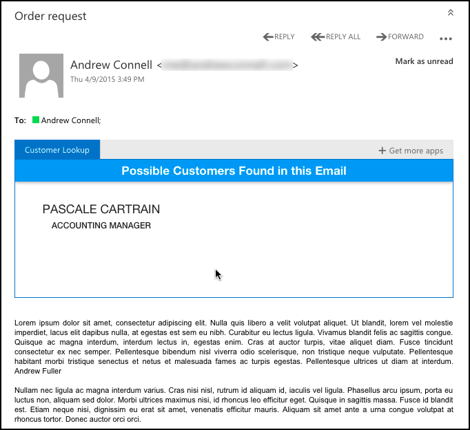

Office Add-in for Outlook using Node.js & Angular
=================================================
This sample demonstrates how to create an Office Add-in for Outlook using non-Micosoft technologies. Office Add-ins are web applications that are referenced by the hosting Office client application. In this sample the web application is implemented as an [Angular 1.3.x](http://angularjs.org) application with two views that calls a server side WebAPI implemented [Node.js](http://www.nodejs.org). All JavaScript in this sample is written using [TypeScript](http://typescriptlang.org). 

The Scenario - End User
-----------------------
The Office-Addin will activate within an email's read form. It collects all title cased words witihn the body of the email and searches a customer database for possible matches. Any matches found are displayed to the user in a summary card. Clicking on the card will change the view and show the details of the customer.

Scenario Explained
------------------
Tha Angular application is written in TypeScript and is compiled down to JavaScript using either the developer's IDE or using a build process implemented using [gulp](http://gulpjs.com/) (*more on the build process below*).



Once the Office Add-in is activated, the Office.js library is used to collect all title case words in the email. This collection of words is then used in a lookup against the sample [Northwind OData v3 service](http://services.odata.org/V3/Northwind/Northwind.svc).

However the Angular application can not directly call the Northwind service. The sample Northwind service is only available via HTTP, not HTTPs. Because the web applications that implement an Office Add-in must be accessible via HTTPS only, we need an intermediary service.

Therefore the Angular application will instead call a custom Web API that contains various RESTful services that respond to HTTPS requests. They in turn will call the Northwind service via HTTP and return the results over HTTPS. This intermediary application is implemented using Node.js & all JavaScript is written using TypeScript.

Developer Application Requirements
----------------------------------
This sample can be run from any platform (Windows, OS X or Linux) and use any developer IDE of choice (Visual Studio, WebStorm, Brackets, notepad). You do need Node.js installed and the following packages must be installed globally on your environment:

- bower
- express
- tsd
- typescript

Install thse globally using the following command:

````
npm install -g bower express typescript tsd
````

Fruthermore you can install the following additional packages globally if you want to run the build process:

- gulp
- nodemon
- node-inspector

### Compile Everything
First obtain all external references, packages & type definitions by running the following command:

````
npm install
````

This will (1) download all NPM packages referenced in the project, (2) download all bower packages and (3) download all TypeScript type definitions. Stes 2 & 3 are done after `npm install` completes as dictated by a script in the `package.json` file. You can run them manually using `bower install` and `tsd reinstall` if you wanted.

Compile the TypeScript, both that used in Node.js & in the Angular application, by running the following command from within the root of the application:

````
gulp compile-ts
````

You can remove all compiled JavaScript and source maps by running the following:

````
gulp clean-ts
````

When developing you can run the following. This will monitor any changes to TypeScript and handlebars files (used as the MVC view engine in the Node.js application). If any changes are detected it will automatically do the following things:

- **lint all TypeScript** (gulp task **lint**): This will check all TypeScript to ensure it meets the coding style rules defined in the [tslint.json](tslint.json) file.
- **update TypeScript references** (gulp tasks **gen-client-tsrefs** & **gen-server-tsrefs**): There are three files referenced at the top of every TypeScript file. The first, **/tools/typings/tsd.d.ts**, contains references to all TypeScript type definition files obtained using the tool [tsd.exe](http://definitelytyped.org/tsd). The other other file that's referenced is either the **/tools/typings/server.d.ts** (if it's a Node.js file) or **/tools/typings/app.d.ts** (if it's an Angular file), references the TypeScript files used within the application. This saves the developer from adding all these references to each and every file in the project. 
- **comile all TypeScript** (gulp tasks **compile-client-ts** & **compile-server-ts**): This compiles all the TypeScript to JavaScript, once for the client side application and once for the server side application.

Running the Application
-----------------------
The application, as it stands in the GitHub repo, is configured to run locally. There are some pre-cursor steps you must do to get this to work because you must setup a self-signed certificate to be trusted on your developer machine. Refer to the steps outlined in the [self-signed-cert-osx.md](../self-signed-cert-osx.md) on how do this this on OS X. You can use the certificates I've created which are located in the root of this repository so you can skip the part about creating the certificates.

If you are going to run this on Windows, you need to setup & trust a self-signed certificate on your developer machine. 


Developing with WebStorm
------------------------
This sample was built using WebStorm, but you can use any IDE you want. The way I developed it was to open a Terminal / command window and run `gulp` which did all the compilation and updates to the app and then monitored it for changes. I also created a new run configuration which is shown in this blog post: [Running and debugging Node.js application](http://blog.jetbrains.com/webstorm/2014/02/running-and-debugging-node-js-application/). For the specific settings in my configuration:

- **Node parameters**: --debug
- **Working directory**: <path to this folder>
- **JavaScript File**: src/server/server.js

Developing with Anything Else
-----------------------------
You can use any tool you want to customize this application, including Visual Studio provided you have the Node.js tools for Visual Studio installed.

If you use any other text editor, you can setup debugging. First turn on **node-inspector** for rich Node.js debugging using the browser's developer tools:

````
node-inspector
````

Then run the following gulp task that will do the same watching, linting & recompilation that I mentioned above, except it will also automatically restart the Node.js process to get the latest code changes:
 
````
gulp watch-nodemon
````